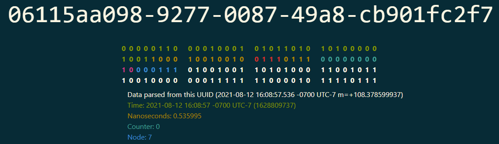
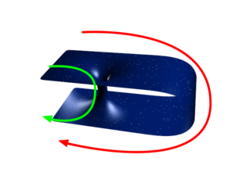
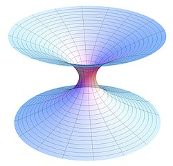

# own chain
https://en.wikipedia.org/wiki/Distributed_computing
https://en.wikipedia.org/wiki/Message_passing

# SonyFlake
# hash UUID Lic MiT

Twitter Snowflake -> **SonyFlake**
https://en.wikipedia.org/wiki/Snowflake_ID
https://pypi.org/project/sonyflake-py/
https://github.com/bahlo/sonyflake-rs/tree/main
https://github.com/sony/sonyflake
https://pypi.org/project/easyflake/
https://metacpan.org/pod/Twitter::ID
https://akashrajpurohit.com/blog/snowflake-id-generating-unique-ids-for-distributed-systems/#:~:text=Snowflake%20ID%20is%20a%2064,since%20a%20certain%20epoch%20time.
https://crates.io/crates/sonyflake
https://github.com/sony

https://habr.com/ru/articles/572700/

# https://datatracker.ietf.org/doc/html/draft-peabody-dispatch-new-uuid-format-01

Universally Unique Identifier (UUID) is a 128-bit label
https://en.wikipedia.org/wiki/Universally_unique_identifier
https://datatracker.ietf.org/doc/html/rfc4122

# S3
https://github.com/minio/minio/tree/master/docs/docker
https://habr.com/ru/companies/otus/articles/801253/

# Monero # XMR
Monero при своей низкой капитализации имеет два технически уникальных решения: 
анонимность транзакций и защита (на уровне алгоритма) от ASIC. 
Собственно ради этого он и создавался на фоне прочих валют. 
И я считаю это как минимум достойным упоминания.

```ts
const size = 256
let index = size
let buffer: string

export function uid(length = 11) {
  if (!buffer || index + length > size * 2) {
    buffer = ''
    index = 0
    for (let i = 0; i < size; i++) {
      buffer += ((256 + Math.random() * 256) | 0).toString(16).substring(1)
    }
  }
  return buffer.substring(index, index++ + length)
}
```
# 
```ts
type Partial<T> = {
    [P in keyof T]?: T[P];
};
// TODO: exact types,
type Exactly<T, U> = T & Record<Exclude<keyof U, keyof T>, never>;
```

# variants uuid v7
Если общее число сущностей за всё время превысит примерно 2^65, 
вероятность коллизий, даже если выкинуть фиксированные биты, достигнет 50%
36893488147419103000

**вероятность коллизий в 50% никого не устроит, 
должно быть минимум 10^(-9). Это всего 2^47 (UUIDv4)**

**Возьмём  UUIDv7**
https://datatracker.ietf.org/doc/html/draft-peabody-dispatch-new-uuid-format-01#section-4.4.4.1

**-------------------------------------------------------------------**
у нас всего 62 бита случайности. 
Это 2^32 сущности при вероятности 50% и 2^17 при вероятности 10^(-9).
Да, это небольшое число, если время остановится, 
очень быстро появится ненулевая вероятность коллизий. 
Но при нормальном течении времени, появление такого количества событий за 2^(-12) секунды 
(около 250мкс) можно только на очень большой распределённой системе. 
Плюс, там еще 12 бит берутся из счётчика тактов CPU, 
это, по сути, еще столько же бит энтропии, пусть они и завязаны на конкретный экземпляр CPU,
но мы ведь про распределённую систему говорим. 
А это значит, что для вероятности 10^(-9) это уже 2^23 элементов.

All 12 bits of subsec_b have been dedicated to a motonic clock sequence counter (seq).
это счётчик для обеспечения монотонности внутри одного тика таймстампа
https://habr.com/ru/users/rrrad/

Судя по статье в Википедии 
https://ru.wikipedia.org/wiki/Unix-%D0%B2%D1%80%D0%B5%D0%BC%D1%8F подразумевается, 
что Unix time - это UTC, но лучше об этом написать в RFC явно. 
То есть, никаких разных таймзон в timestamp нет.

есть простая цель: сделать btree-friendly вариант uuid

**-------------------------------------------------------------------**

**Q) существует ли надежный способ генерации id по hardware?**

# https://habr.com/ru/articles/572700/


http://www.new-uuid.info/
https://habr.com/ru/companies/ozontech/articles/564520/
поле correlation.
статистическая корреляция между физическим порядком строк и логическим порядком значений столбца


**Эта версия идентификатора бинарно-сортируемая.** 
То есть, вам больше не нужно конвертировать значения UUID в какой-либо другой формат,
чтобы понять какое из них больше и меньше.

https://news.ycombinator.com/item?id=28088213
UUIDv1 time-based
UUIDv2 legacy DCE security thing, not wideley used
UUIDv3 name-based with md5 hashing
UUIDv4 randomness-based
UUIDv5 name-based with sha1 hashing

This draft registers a few new sub-types:

UUIDv6 sortable time-based, Gregorian calendar
UUIDv7 sortable time-based, Unix time
UUIDv8 sortable time-based, custom time

LexicalUUID by Twitter
Snowflake by Twitter
Flake by Boundary
ShardingID by Instagram
KSUID by Segment
Elasticflake by P. Pearcy
FlakeID by T. Pawlak
**Sonyflake by Sony**
orderedUuid by IT. Cabrera
COMBGUID by R.Tallent
ULID by A. Feerasta
https://github.com/Sofya2003/ULID-with-sequence
SID by A. Chilton
pushID by Google
XID by O. Poitrey
ObjectID by MongoDB
CUID by E. Elliott


всё-таки поддерживаем совместимость с uuid (поля ver и var), потеря 6 бит не критична;
не пытаемся обеспечить строгую монотонность, для btree она не нужна; и в распределённой (и даже многопоточной) системе она если и возможна, то превращается в головную боль;
с учётом предыдущего пункта, точность выше миллисекунд не нужна, тем более, что обычные протоколы синхронизации времени не обеспечивают особой точности;
только timestamp и random, ничего больше не храним, ни идентификаторов, ни последовательных номеров. чем больше рандома — тем лучше;
выделение timestamp из uuid категорически не рекомендуется для чего-то помимо отладки и т. п.
в timestamp храним время генерации uuid, так что предусматривать кодирование «до нашей эры» и «через 5000 лет» не нужно;

итого, в первом приближении: 44 бита беззнаковый timestamp в миллисекундах (хватит примерно на 500 лет вперёд), 78 бит рандома.

остающиеся вопросы:

достаточно ли 78 бит рандома для практического отсутствия коллизий? может быть лучше хранить время с секундной точностью, а поле рандома расширить на 10 бит? (хотя с первого взгляда это принципиально ничего не изменит — использование миллисекунд тоже снижают вероятность коллизий)
нужно ли резервировать номер для новой версии, или «мимикрировать» под uuidv4 (если мы решаем, что извлечение даты из uuid — плохой тон, то для читающего приложения нет совершенно никакой разницы является ли uuid полностью случайным, или же включает в себя время).

https://habr.com/ru/articles/572700/#comment_23371300
Счетчик (clock sequence) позволяет этого избежать, так как упорядочивает UUID, сгенерированные в течение миллисекунды

https://docs-python.ru/standart-library/modul-secrets-python/

https://github.com/sergeyprokhorenko/pg_ulid_comparison

наиболее частый вариант похож на случай, 
когда 100500 пользователей в рандомном порядке добавляют в таблицу свои данные. 
А потом требуется каждому пользователю показать список только его данных

Clustered indexes (MSSQL, MySQL, Oracle)


https://habr.com/ru/articles/572700/#comment_23368212
https://infostart.ru/1c/articles/635159/
Почему нельзя использовать время из GUID?
Во-первых, гуид может быть случайным, а не основаным на времени.
Во-вторых, гуиды выдаются пулом по 32 штуки для каждого сеанса.
В-третьих, гуид случаен по своему стандарту и время в нем это лишь способ сгруппировать первичные ключи 
для уменьшения ширины В-дерева и ускорения операций вставки в кластерный индекс!

https://habr.com/ru/articles/572700/#comment_23382172
первым делом выпиливаю неидемпотентный метод POST, заменяя его на идемпотентный метод PUT 
с записью по генерируемому на клиенте гуиду, а с клиента выпиливаю львиную часть костылей

https://habr.com/ru/articles/572700/#comment_23418560
https://habr.com/ru/articles/572700/#comment_26116648
Q) 06115ad596-0873-0087-5764-c1f3730d90
хм, а разве первый символ в средней группе не должен равняться номеру спецификации (7) ?

# i ??
самоидентификация
https://ru.wikipedia.org/wiki/дежавю
https://ru.wikipedia.org/wiki/Временная_петля
https://ru.wikipedia.org/wiki/Эффект_бабочки

Состояние дежавю сопровождается деперсонализацией: 
реальность становится расплывчатой и неясной. 
Пользуясь терминологией Фрейда, можно сказать, что наступает «дереализация» личности 
— как бы отрицание её реальности.
Дежавю — это ошибка мозга, который перестраивает кратковременную память в долгосрочную и из-за этого воспроизводит момент, 
который вы только что видели, в момент, который был когда-то

https://monocler.ru/mozhet-li-nauka-obyasnit-fenomen-dezhavyu/


Миф о Сизифе
https://dzen.ru/a/ZDaqLtuUvFXf0l5z
# Треугольник Triangle, 2009 Джесс Jess

Временная петля
Азазель Аеолус Хех Астарта Хадеш Эолай
https://dzen.ru/a/Y1lsyye_ihFOxEjx
виды мифологии
Альбер Камю vs Франц Кафка
философии абсурдизма
https://briefly.ru/kamju/mif_o_sizife/
https://briefly.ru/devid_bruks/po_doroge_k_kharakteru/
хаос Бабочка Лоренца
Квантовая погодная бабочка (мотылекус буреносус)
Крото́вая нора́, или «крото́вина», «кротови́на»[1], а также «червячный переход» или «червото́чина» 
(последнее является дословным переводом англ. wormhole)
wormhole — топологическая особенность пространства-времени, 
представляющая собой в каждый момент времени «тоннель» в пространстве

Мост_Эйнштейна_—_Розена

AMPS firewall
Хуан Малдасена и Леонард Сасскинд предположили, 
что частицы в запутанном квантовом состоянии соединены крошечными «кротовыми норами

https://habr.com/ru/articles/804651/
https://habr.com/ru/articles/804345/
https://www.unb.ca/cic/datasets/ids-2017.html

PepeT
грязная лягушка
SLA100
Ship (тонет tx's) ; Air; Gвоз; 