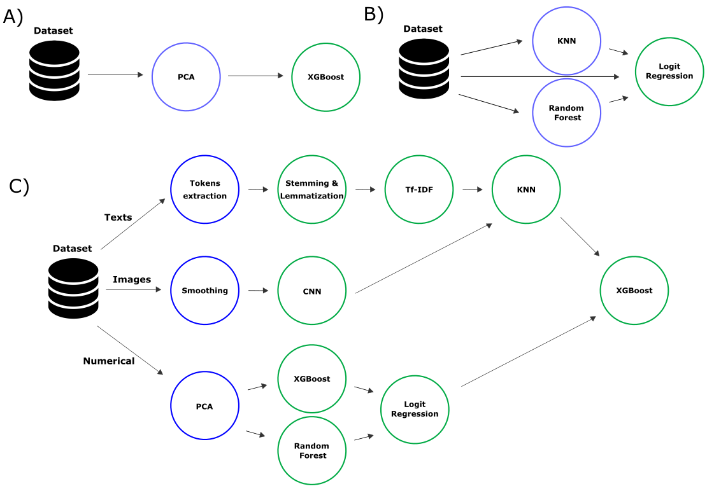

# Frameworks

! pip install pyspark
! pip install pyarrow

pip install optuna
pip install optuna-dashboard

Каждый логический вход в ML-модель называется признаком/предиктором или фичей
(от англ. feature). Feature-engineering считается одной из самых трудоемких задач ML: 
много времени уходит на поиск нужных данных, изучение их особенностей и крайних случаев.
Также сюда входит построение конвейеров данных (data pipeline) 
для их очистки и преобразования в пригодную для использования форму

# Feature Store
https://www.featurestore.org/
https://github.com/featurestoreorg/featurestore-benchmarks/tree/main
data-driven компании независимо друг от друга пришли к одному и тому же выводу: 
AirBnB построил Zipline, Uber создал Michelangelo, а Lyft разработал Dryft. 
Сюда же можно отнести StreamSQL Все эти системы называются хранилищами фичей (Feature Store)

# RSS
https://tembo.io/feed.xml
# ?
https://github.com/sony/nnabla
https://github.com/sony/model_optimization
https://github.com/orgs/sony/repositories
# openai
Hivemind: decentralized deep learning in PyTorch
https://github.com/learning-at-home/hivemind
https://pytorch.org/tutorials/intermediate/ddp_tutorial.html

# openai
https://github.com/lucidrains/PaLM-rlhf-pytorch
pip install palm-rlhf-pytorch

# params optune
https://github.com/topics/hyperparameter-optimization
optuna

pip install hivemind

pip install optuna
pip install optuna-dashboard

https://github.com/optuna/optuna-examples

https://github.com/optuna/optuna?tab=readme-ov-file
https://habr.com/ru/companies/otus/articles/801463
https://github.com/topics/hyperparameter-optimization
https://optuna.readthedocs.io/en/stable/tutorial/10_key_features/005_visualization.html
Tune: Scalable Hyperparameter Tuning
# RAPIDS
https://habr.com/ru/companies/otus/articles/802721/
# AutoML
https://awesomeopensource.com/projects/automl
https://github.com/openml/automlbenchmark

https://lightautoml.readthedocs.io/en/latest/
https://habr.com/ru/companies/spbifmo/articles/558450/
https://habr.com/ru/companies/evraz/articles/723070/
# ray
https://docs.ray.io/en/latest/ray-observability/index.html
https://docs.ray.io/en/latest/ray-air/getting-started.html
# datasets
https://www.unb.ca/cic/datasets/ids-2017.html
https://github.com/yandex-research/RuLeanALBERT
https://huggingface.co/yandex/RuLeanALBERT
https://habr.com/ru/companies/yandex/articles/688234/
# structs
conversation tree

# sora open-sora video vids
https://github.com/PKU-YuanGroup/Open-Sora-Plan
https://openai.com/sora
https://huggingface.co/hpcai-tech/Open-Sora
https://github.com/hpcaitech/Open-Sora

# ColossalAI
# CarperAI
https://github.com/CarperAI/trlx
https://github.com/hpcaitech/ColossalAI
