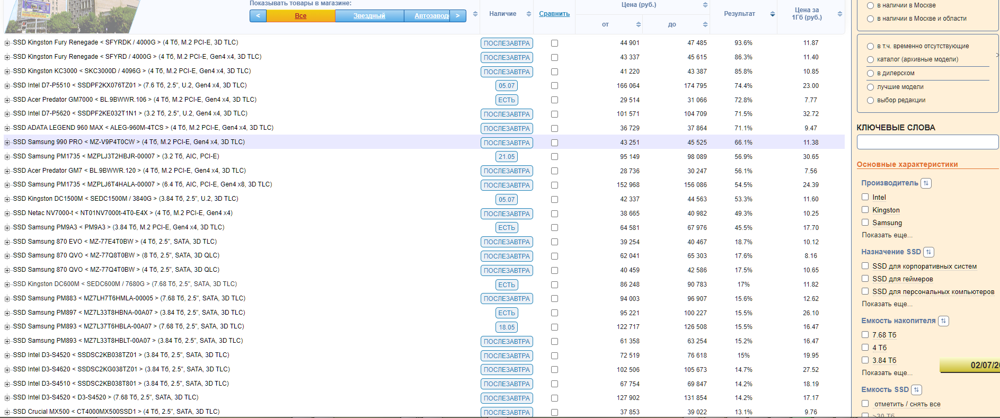
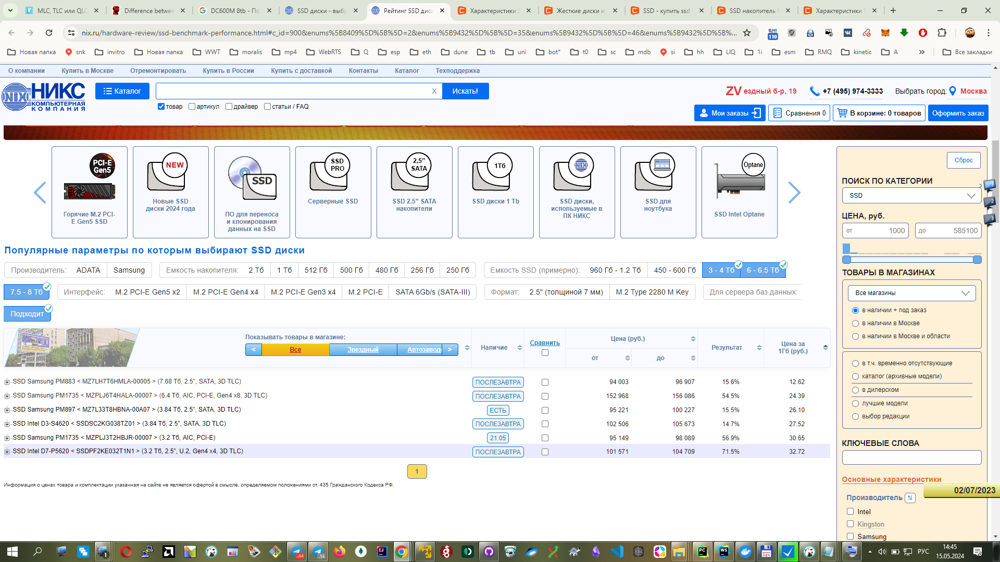
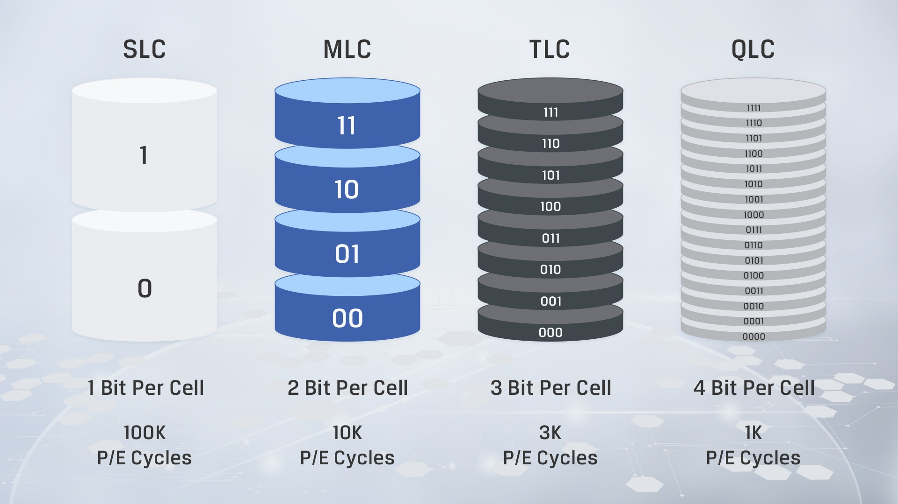
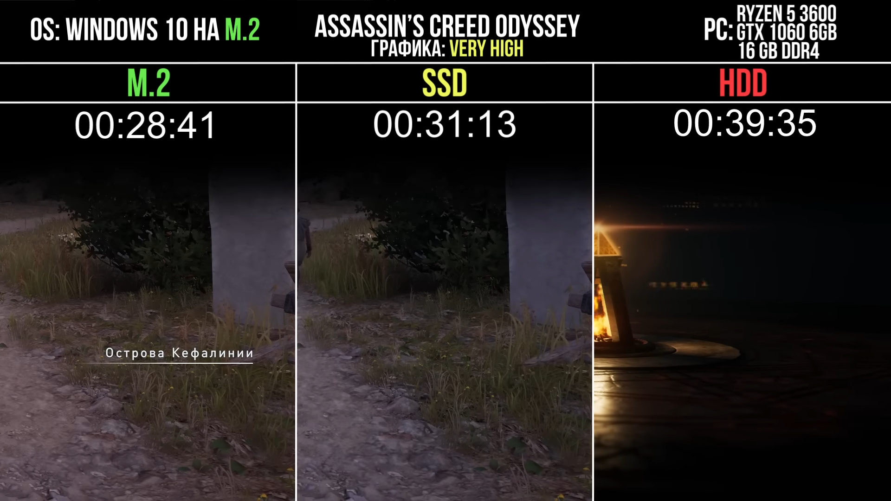
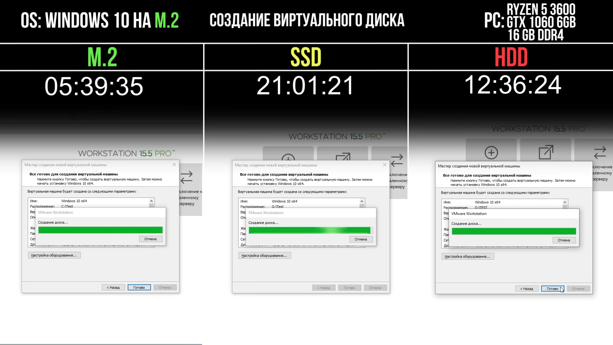
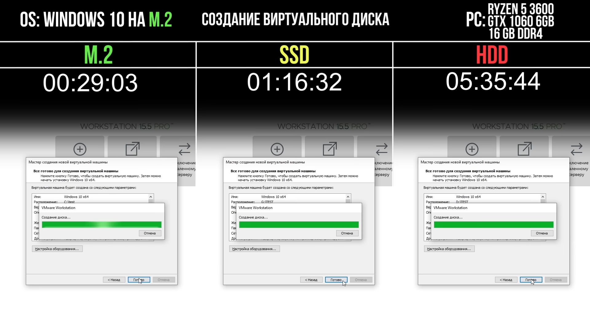

# Q1 pci lines num in cpu with integrated vidocard ?
https://club.dns-shop.ru/blog/t-102-materinskie-platyi/79525-na-chto-vliyaet-kolichestvo-linii-pci-express/

# Q2 ssd ?
https://www.kingston.com/en/ssd/dc600m-data-center-solid-state-drive?capacity=7.68tb
where to buy

https://www.nix.ru/hardware-review/ssd-benchmark-performance.html#c_id=900&enums%5B9432%5D%5B%5D=35&enums%5B9432%5D%5B%5D=46&enums%5B9432%5D%5B%5D=49&fn=900&g_id=598&new_goods=0&page=all&sort=-t&spoiler=1&store=msk-0_1721_1&thumbnail_view=2

https://www.amazon.com/XPG-GAMMIX-Blade-Internal-Gaming/dp/B0CTNR9Y11?ref_=ast_sto_dp&th=1
AGAMMIXS70B-8T-CS

https://www.ozon.ru/category/ssd-nakopiteli-15712/?formfactorm=100107092&opened=volumeinternalssddriveforfilters&sorting=price&volumeinternalssddriveforfilters=100493693

https://www.nix.ru/autocatalog/ssd_kingston/SSD-768-Tb-SATA-6Gb-s-Kingston-DC600M-SEDC600M-7680G-25_761202.html
**?? Для сервера баз данных	Не подходит**

# выбрать пункт для сервера баз данных
https://www.nix.ru/hardware-review/ssd-benchmark-performance.html#c_id=900&enums%5B8409%5D%5B%5D=2&enums%5B9432%5D%5B%5D=35&enums%5B9432%5D%5B%5D=46&enums%5B9432%5D%5B%5D=49&fn=900&g_id=598&new_goods=0&page=all&sort=d&spoiler=1&store=msk-0_1721_1&thumbnail_view=2

# ssd
https://www.kingston.com/en/ssd/dc600m-data-center-solid-state-drive
https://www.kingston.com/en/blog/pc-performance/difference-between-slc-mlc-tlc-3d-nand?capacity%20range=3.84tb%20-%204tb

https://www.citilink.ru/catalog/zhestkie-diski/?pf=discount.any%2Crating.any&f=discount.any%2Crating.any%2C9146_32

https://www.citilink.ru/product/ssd-nakopitel-kingston-dc600m-sedc600m-3840g-3-8tb-2-5-sata-iii-sata-1974004/

Samsung 8 ТБ Внутренний SSD-диск 870 QVO (MZ-77Q8T0BW)
https://www.ozon.ru/product/samsung-8-tb-vnutrenniy-ssd-disk-870-qvo-mz-77q8t0bw-750735302/?reviewsVariantMode=2&tab=questions

Seagate 4 ТБ Внутренний SSD-диск FireCuda (ZP4000GM3A023)

Seagate 18 ТБ Внутренний SSD-диск 16TB (ST18000NM000J)

Seagate 4 ТБ Внутренний SSD-диск FireCuda (ZP4000GM3A023.)

https://www.citilink.ru/catalog/ssd-nakopiteli/?pf=discount.any%2Crating.any&f=discount.any%2Crating.any&r=25320_580%3A3650-15728.64
https://www.citilink.ru/catalog/ssd-nakopiteli/?sorting=price_asc&pf=discount.any%2Crating.any&f=discount.any%2Crating.any%2C9230_5803dd1tlc&r=25320_580%3A3650-15728.64

# MLC vs TLC
**TLC (Triple-Level Cell) SSDs are generally slower than MLC (Multi-Level Cell) SSDs.** 
This is because TLC SSDs need to check and translate more voltage levels back to bits during the read operation, having four more voltage levels than MLC SSDs. The increased complexity in interpreting the stored data slows down the read process, making MLC SSDs faster in comparison [3].

Citations:
[1] https://coastipc.com/blog/post/mass-storage-update-mlc-vs-tlc-and-m2-sata-vs-m2-nvme#:~:text=Speed%20%E2%80%94%20the%20amount%20of%20time,and%20TLC%20slower%20than%20MLC.
[2] https://www.kingston.com/en/blog/pc-performance/difference-between-slc-mlc-tlc-3d-nand
[3] https://blog.purestorage.com/purely-informational/mlc-vs-tlc-which-is-the-better-ssd/
[4] https://www.reddit.com/r/buildapc/comments/15qqrni/which_m2_ssd_memory_type_slc_mlc_tlc_and_3d_nand/
[5] https://www.acnc.com/blog/solid-state-storage/mlc-vs-tlc/
[6] https://superuser.com/questions/1618534/how-fast-are-different-types-of-ssd-storage-slc-mlc-tlc-qlc
[7] https://www.quora.com/How-fast-is-SLC-MLC-TLC-and-QLC-NAND-storage-SSD-admin
[8] https://forums.tomshardware.com/threads/does-it-matter-if-the-ssd-is-tlc-or-mlc-in-the-long-run.3754930/
[9] https://www.speedguide.net/faq/slc-mlc-or-tlc-nand-for-solid-state-drives-406

# https://uchet-jkh.ru/i/kak-vybrat-mezdu-tlc-3d-nand-i-mlc-sravnenie-i-rekomendacii/
MLC (Multi-Level Cell) – это тип памяти, который может хранить два или больше бит в одной ячейке. Это позволяет увеличить емкость памяти, однако при этом производительность значительно снижается. Таким образом, скорость чтения и записи данных на устройствах с MLC-памятью заметно ниже, что может замедлить работу компьютера или другого устройства.

TLC (Triple-Level Cell) 3D NAND – это более новый и продвинутый тип памяти. В ячейке памяти TLC может храниться три и более бита информации. Это позволяет создавать более емкие накопители, однако скорость записи и чтения данных на устройствах с TLC-памятью остается высокой. Таким образом, данные могут передаваться быстрее по сравнению с MLC-памятью, что в свою очередь повышает общую производительность устройства.
Источник: https://uchet-jkh.ru/i/kak-vybrat-mezdu-tlc-3d-nand-i-mlc-sravnenie-i-rekomendacii

motherboard amd with 3 m2 nvme
# mboard 2 m2 ssd nvme
https://www.dns-shop.ru/catalog/17a89a0416404e77/materinskie-platy/?stock=now-today-tomorrow-later&f[rv3r]=13j4v3
# mboard 3 m2 ssd nvme
https://www.dns-shop.ru/catalog/17a89a0416404e77/materinskie-platy/?stock=now-today-tomorrow-later&f[rv3r]=13j4v4

# m2 nvme vs ssd vs hdd
https://www.youtube.com/watch?v=WFocL98cCXw

https://youtu.be/WFocL98cCXw?t=927
это заполненные наполовину ssd

https://youtu.be/WFocL98cCXw?t=971

SSD M.2 2280 - A-DATA XPG SX8200 Pro ASX8200PNP-256GT-C 256GB
SSD SATA III - A-DATA SU655SS-240GT-C 240GB
HDD 7200об/мин - SEAGATE BARRACUDA ST1000DM010 1TB

https://youtu.be/4DKLA7w9eeA

# NAS
https://www.citilink.ru/product/zhestkii-disk-seagate-ironwolf-st8000vn004-8tb-hdd-sata-iii-3-5-1528019/