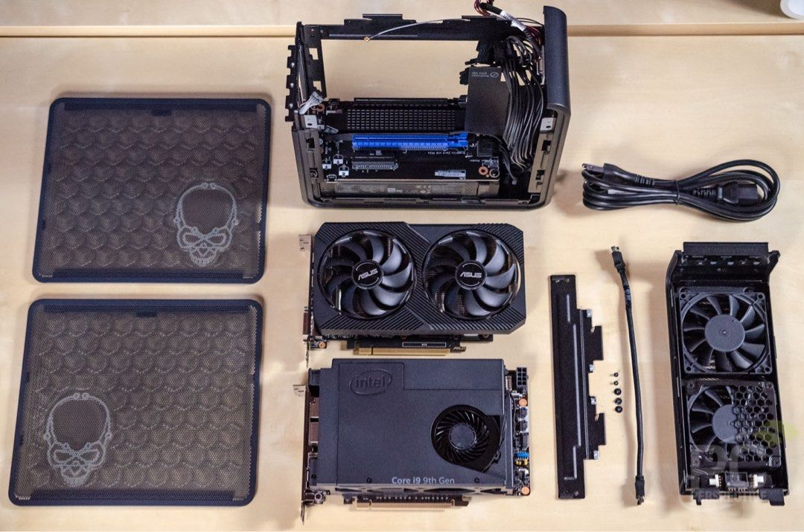
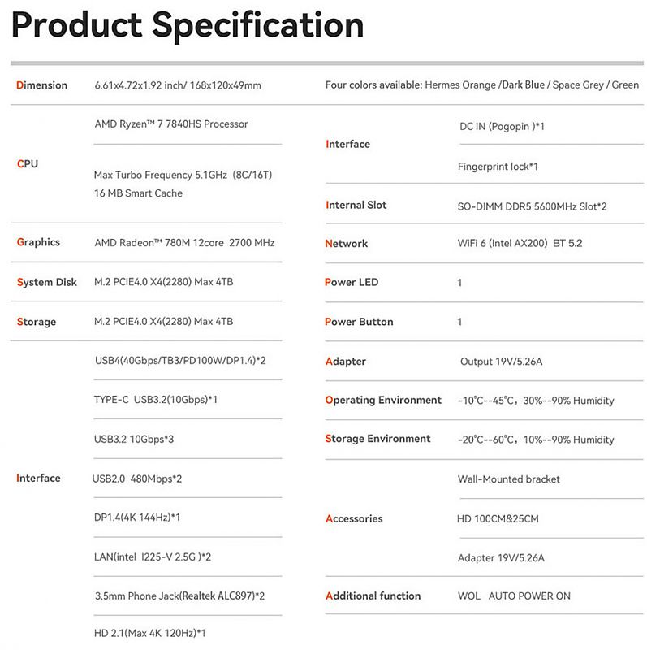
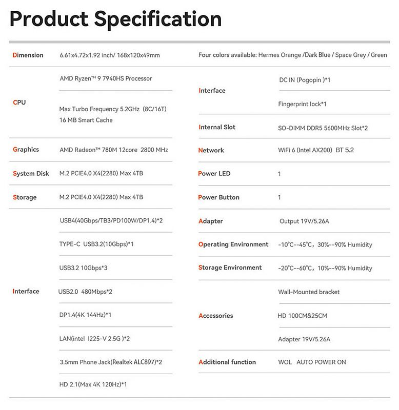
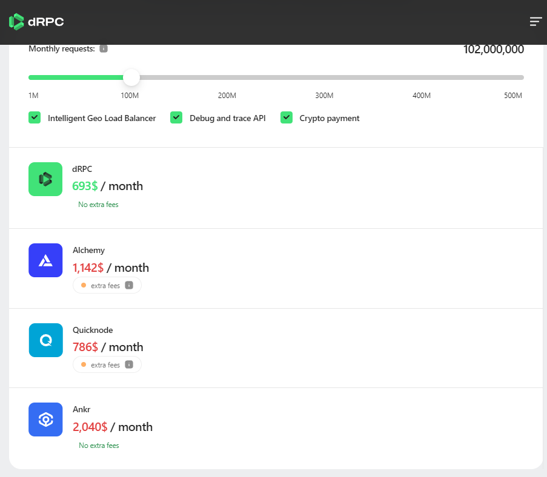

# Erigon Archive Node - NUC or Barebone PC Recommendation

https://nodes.guru/
https://t.me/NodesGuru_bot
https://drpc.org/chainlist


Ayaneo — AM02.
1н диск до 8 терабайт
https://youtu.be/4Im5sOPWPXI?t=473
https://youtu.be/4Im5sOPWPXI?t=806

NAS NVME RAID0
https://youtu.be/p7UNMQIjd50?t=399

!!! https://github.com/ledgerwatch/erigon/issues/6500
NFS - it doesn’t support POSIX flock.
You need some non-network file system
I am running erigon on an aliyun nas server.
2、linux file-system
xxxcn-hongkong.nas.aliyuncs.com:/ nfs 1.0P 11T 1014T 2% /data3/pploy_erigon_data

It must not be NFS. Because Database need POSIX flock feature.
https://help.aliyun.com/product/27516.html?spm=5176.59209.J_5834642020.4.6e6576b9ZT764b
Alibaba Cloud File Storage NAS

ASrock DeskMini B660 (LGA1700) or X300 (AM4).
Both take two 2.5" SATA drives and two NVMe drives; 
Gen5/Gen4 on the B660 and Gen3/Gen3 on the X300

https://aliexpress.ru/popular/nvme-nas.html


```bash
docker run -d --name erigen -p 8833:30303 -p 8838:8545 -p 8835:9090 
-v /data3/pploy_erigon_data:/root/erigon/data/ 
erigon supervisord -n -c /etc/supervisor/supervisord.conf
```

Once you set up your node hardware and configure the client, 
you can start with the Ethereum blockchain using libraries (ethers.js/web3.js) & JSON-RPC calls. 
For example, you can try to get the balance for an old address by calling the `eth_getBalance` function.


https://aliexpress.ru/item/1005005787292655.html?spm=a2g2w.detail.pers_rcmd.11.15704319kp7zZC&mixer_rcmd_bucket_id=aerabtestalgoRecommendAbV20_controlRu1&pdp_trigger_item_id=0_1005005518640501&ru_algo_pv_id=4a6544-476f2e-45fc5e-da21d7-1711101600&scenario=pcDetailBottomMoreOtherSeller&sku_id=12000034353080545&traffic_source=recommendation&type_rcmd=core
https://novosibirsk.e2e4online.ru/catalog/item/ssd-mastero-2tb-sata3-mst-ssd-2tb-1205118/


https://www.youtube.com/watch?v=aQOrkHSyxNQ

https://aliexpress.ru/item/1005006075053161.html?sku_id=12000035613627553
https://max.nix.ru/autocatalog/barebone/Intel-NUC-Kit-BKNUC9V7QNX2-i7-9850H-46-GGts-PCI-E-HDMI-2xGbLAN-3xM2-2DDR4-SODIMM_478446.html
https://www.avito.ru/orel/nastolnye_kompyutery/mini_pk_intel_nuc_9_pro_kit_-_nuc9v7qnx_3599414923?context=H4sIAAAAAAAA_0q0MrSqLrYytFKqULIutjI2tFJKNk6uzCgwqixKtyw1TDXPSyw1zkzJyEutLE0yKDY2U7KuBQQAAP__Mp3AcjUAAAA

https://www.carousell.com.hk/p/intel-nuc-9-nuc9v7qnx-i7-%E6%BA%96%E7%B3%BB%E7%B5%B1-1268798161/
Intel NUC 9 Pro NUC9V7QNX
https://www.intel.com/content/dam/support/us/en/documents/intel-nuc/nuc-kits/NUC9QN_TechProdSpec.pdf
https://saratov.nix.ru/autocatalog/barebone/Intel-NUC-Kit-BKNUC9V7QNX2-i7-9850H-46-GGts-PCI-E-HDMI-2xGbLAN-3xM2-2DDR4-SODIMM_478446.html

https://androidpctv.com/gmktec-k8-mini-pc/
GMKtec Мини-ПК NucBox K8 (AMD Ryzen 7 8845HS (3.8 ГГц), RAM 64 ГБ, SSD 4096 ГБ, AMD Radeon 780M, Windows), K8, серебристый
Aoostar Gem12 Pro
https://bee-link.ru/catalog/mini-pc?224=Ryzen

Beelink GTR7
https://bee-link.ru/gtr7


https://bee-link.ru/gtr7pro


info@bee-link.ru
Адрес: Научный пр-д, 8 стр. 1, Москва, 117246  (Офисный центр «На Научном»). Тел. 8 (495) 510-49-75


https://t.me/MiTechStore/456
https://youtu.be/a7krnyIpZoo?t=463

ASrock DeskMini B660 (LGA1700) or X300 (AM4).
asrock deskmini x300
Both take two 2.5" SATA drives and two NVMe drives; Gen5/Gen4 on the B660 and Gen3/Gen3 on the X300.

https://www.ozon.ru/category/mikrokompyutery-15707/minisforum-100467740/


Echo 236FR
https://www.cappuccinopc.com/echo.asp?series=echo236f
https://www.manualslib.com/manual/2329208/Unicomp-Labs-Echo236f.html?page=29

Storage: The Echo 236FR comes with 2 SATA III (6Gbps) and 2 mSATA (Mini PCIe Type, 6Gbps) slots, providing ample space for SSDs. 
Although the product description does not explicitly mention RAID support, 
it does feature Intel® Firmware Raid 0 and 1 (Mirror) configurations for Windows OS, indicating that RAID functionality is available.

Aoostar Gem12 Pro
https://www.ixbt.com/live/platform/zachem-nuzhen-displey-vstroennyy-v-mini-kompyuter-predstavlen-ofisnyy-aoostar-gem12-pro-na-baze-ryzen-7-8845hs.html

https://vk.com/wall-29218811_1243243
https://www.tomshardware.com/desktops/mini-pcs/gem12-pro-mini-pc-uses-an-amped-up-ryzen-7-8845hs-apu-has-a-built-in-mini-screen-and-oculink-support
https://liliputing.com/aoostar-gem12-pro-mini-pc-has-an-oculink-port-optional-status-display-and-up-to-amd-ryzen-7-8845hs/#:~:text=Mini%20PC%20maker%20AOOSTAR%20has,2280%20PCIe%204.0%20NVMe%20SSDs.
https://www.amazon.com/stores/WelcometoAOOSTARandwelookforwardtoservingyou/page/627C9259-700C-443B-908A-A7058122DDEE?&linkCode=sl2&tag=lp_daily_deals-20&linkId=3e79801a38312c0caf4db81a4dab937b&language=en_US&ref_=as_li_ss_tl
https://dtf.ru/u/52802-nicromarti/2528751-mini-pk-gem12-pro-osnashen-ryzen-8845hs-kulerom-s-parovoi-kameroi-vstroennym-ekranom-skanerom-otpechatkov-i-oculink
https://www.techpowerup.com/cpu-specs/ryzen-7-8845hs.c3400?ref=dtf.ru
https://club.dns-shop.ru/digest/114529-v-assortimente-aoostar-poyavilsya-mini-pk-gem12-pro-s-ekranom-ocu/

https://www.reddit.com/r/ethstaker/comments/tlxp31/erigon_execution_client_sync_experience_and_disk/
https://github.com/ledgerwatch/erigon/issues/3685
Lenovo m75q Gen2
512 GB NVME SSD (used only for OS)
4 TB SATA SSD, used for Blockchain data (Sandisk Ultra, TLC)
16 GB RAM
Ryzen 6-Core (with SMT)
Software
Ubuntu 20.04
Erigon 2022.03.01-beta via Docker (branch: stable, 785539f)
--prune.r.before=11184524
--prune htc


https://minisforum.com.ru/hx90
https://bee-link.ru/gtr-5
https://bee-link.ru/catalog/mini-pc
https://www.amazon.ae/Beelink-5900HX-Computer-Display-2-5Gbps/dp/B09SYR619R?th=1
MINISFORUM Мини-ПК HX90_No RAM No Storage (AMD Ryzen 9 5900HX (3.3 ГГц), RAM 0, AMD Radeon Graphics, ), черный, синий
https://www.ozon.ru/product/minisforum-mini-pk-hx99g-amd-ryzen-9-6900hx-3-3-ggts-ram-otsutstvuet-amd-radeon-rx-6650m-8-gb-1440299309/?asb=wIt4Nn4vMfklw4tpgzdgd%252BA4MVyiCidxFaDxidKVkpA%253D&asb2=HhMWLCIcL6Z9upf8ERs5bxAV3WqLT6GME0HFxABllu9jCHk6fQSCddeI15um-2J6g8gyLoRbqrKY83lSxb_TqA&avtc=1&avte=2&avts=1709619160&keywords=MINISFORUM+%D0%9C%D0%B8%D0%BD%D0%B8-%D0%9F%D0%9A+HX90_No+RAM+No+Storage+%28AMD+Ryzen+9+5900HX+%283.3+%D0%93%D0%93%D1%86%29%2C+RAM+0%2C+AMD+Radeon+Graphics%2C+%29%2C+%D1%87%D0%B5%D1%80%D0%BD%D1%8B%D0%B9%2C+%D1%81%D0%B8%D0%BD%D0%B8%D0%B9#section-description--offset-140
https://i2hard.ru/publications/34669/
https://github.com/jclapis/rocketpool.github.io/blob/main/src/guides/local/hardware.md

https://github.com/jclapis/rocketpool.github.io/blob/main/src/guides/local/hardware.md
https://nownodes.io/blog/how-to-run-an-ethereum-node-a-comprehensive-guide/
https://nownodes.io/pricing
https://cloud.google.com/blockchain-node-engine/docs/using-nodes-ethereum
Ethereum	Full	$0.69 per hour
Ethereum	Archive	$2.74 per hour
https://cloud.google.com/products/calculator?hl=ru

reddit.com/r/ethstaker/comments/14vt8el/best_website_to_host_an_ethereum_node/

https://www.lenovo.com/ru/ru/desktops/thinkcentre/m-series-tiny/ThinkCentre-M75q-Gen-2/p/11TC1MTM7G2?orgRef=https%253A%252F%252Fwww.google.com%252F

# remote arch full nodes hosting 

https://drpc.org/pricing
