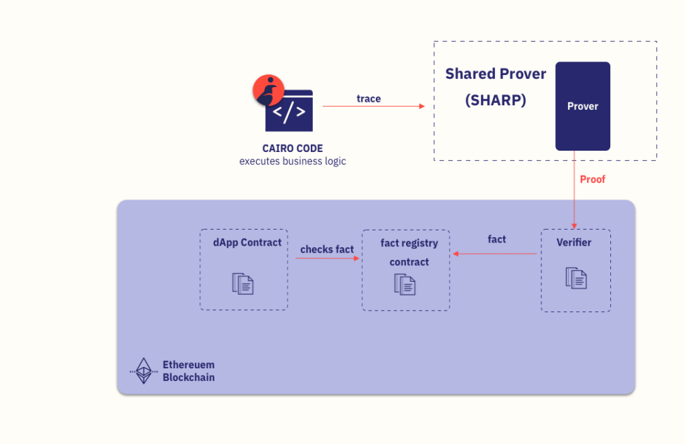

Cairo is a language for writing provable programs: 
running a Cairo program produces a trace 
that can then be sent to a trustless prover, which generates a STARK proof

The SHARP is the connecting link between 
your Cairo code 
and 
your Solidity smart contract. 
It has three main components 
– a prover (off-chain), 
- a verifier smart contract (on-chain) and 
- a FACT REGISTRY CONTRACT (on-chain)

https://docs.swmansion.com/scarb/
https://docs.swmansion.com/scarb/download#windows
https://docs.cairo-lang.org/reference/syntax.html#comments
https://docs.cairo-lang.org/sharp.html
https://github.com/cairo-nix/cairo-nix
https://docs.swmansion.com/scarb/download#windows
https://www.cairo-lang.org/cairo-for-blockchain-developers/
