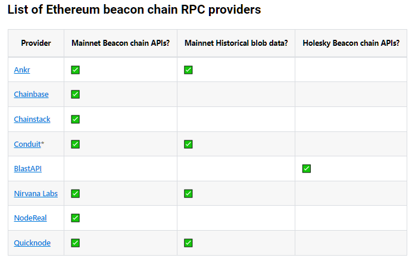

# paid

https://docs.arbitrum.io/build-decentralized-apps/reference/node-providers

https://www.ankr.com/advanced-api/
# VARS
ankr
https://getblock.io/pricing/
https://www.quicknode.com/docs/ethereum
https://www.quicknode.com/pricing
https://nirvanalabs.io/pricing
https://nirvanalabs.io/dashboard/nodes

Nodes = [ ETH ARB Base ]

p2p
ANKR/USDT ~ 0.04319
MM
https://www.ankr.com/remote-procedure-call/

https://www.ankr.com/docs/node-snapshot/

https://www.ankr.com/docs/staking-for-developers/oracles/overview/

https://github.com/Ankr-network/ankr.js
https://www.ankr.com/docs/rpc-service/chains/chains-api/eth-beacon/

https://t.me/eth_newbie/24636
https://t.me/eth_newbie/24639

# who-what-use
https://t.me/eth_newbie/34213
https://t.me/eth_newbie/25881

https://t.me/eth_newbie/25869

# snapshot node tar
**https://snapshot.arbitrum.foundation/index.html**

**https://docs.arbitrum.io/run-arbitrum-node/more-types/run-archive-node**

**arb1 ~ 4.5 tb**
**sepolia ~ 2.2 tb**

sepolia -- nitro-pruned.tar 165gb

https://docs.arbitrum.io/run-arbitrum-node/run-full-node

# top tokens
https://arbiscan.io/tokens?sort=percent_change_24h&order=desc

# token
https://arbiscan.io/token/0xfe8c1ac365ba6780aec5a985d989b327c27670a1#balances

# Arbitrum Unique Addresses Chart
https://arbiscan.io/chart/address

# Arbitrum Daily Transactions Chart
https://arbiscan.io/chart/tx

# verify
https://arbiscan.io/chart/verified-contracts

