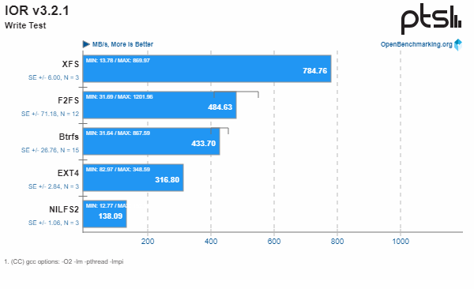
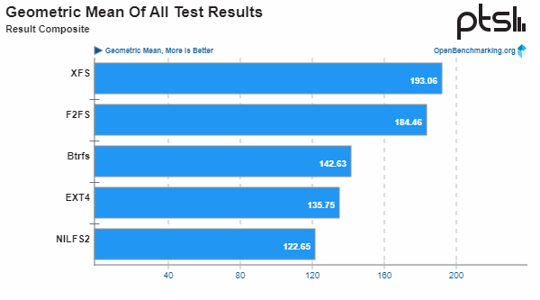
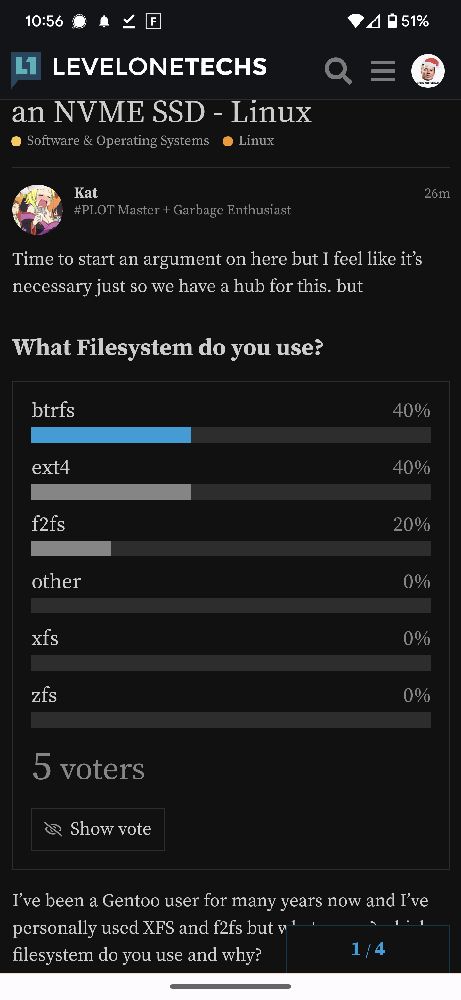

https://www.youtube.com/watch?v=E3D4cp_OnwI
https://www.phoronix.com/review/linux-58-filesystems/4

result

https://openbenchmarking.org/embed.php?i=2007018-NE-SSDSTORAG93&sha=a11596e&p=2

Один диск или RAID 0/1/10, корневой раздел == BTRFS,
большие пулы с рейдом четности == ZFS

