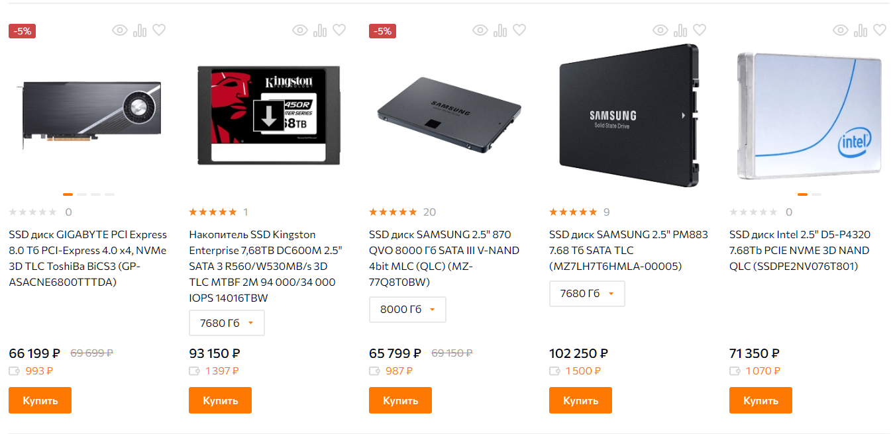
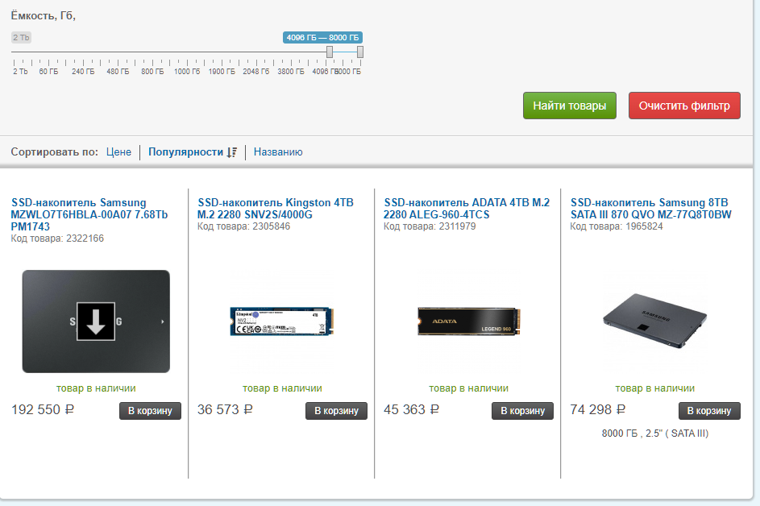

# nvme ssd 2280 tlc ??
https://www.onlinetrade.ru/catalogue/ssd_diski-c294/?price1=1050&price2=254250&volume[]=6400%20%C3%E1&volume[]=7000%20%C3%E1&volume[]=7680%20%C3%E1&volume[]=8000%20%C3%E1&advanced_search=1&preset_id=0&rating_active=0&special_active=1&selling_active=1&producer_active=1&price_active=0&volume_active=1&form_factor_active=1&interfeys_active=1&interface_active=1&tip_pamyati_active=1&nalichie_bufera_active=0&read_speed_active=1&write_speed_active=1&radiator_active=1&cat_id=294

https://topcomputer.ru/katalog/416-ssd-diski/?arrFilter_P1_MIN=1285&arrFilter_P1_MAX=192550&arrFilter_1005_MIN=1005_2697538046&arrFilter_1005_MAX=1005_1734951818&set_filter=Y

https://www.corsair.com/ru/ru/c/data-storage/m2-ssd

https://www.ozon.ru/product/seagate-4-tb-vnutrenniy-ssd-disk-firecuda-zp4000gm3a023-1263330776/

аппаратный сервер сейчас это 
либо гипервизор c кучей ВМ, 
либо сервер с бекапами (куча дисков по 10+ Тб в RAID5/6 / RAIDZ1/2/3)
либо высоконагруженный СУБД SQL сервер

# сборка
https://www.dns-shop.ru/product/44f1841ed055ed20/8000-gb-ssd-m2-nakopitel-adata-xpg-blade-s70-agammixs70b-8t-cs/
8000 ГБ SSD M.2 накопитель ADATA XPG BLADE S70 [AGAMMIXS70B-8T-CS]
75000 руб

https://megamarket.ru/catalog/details/vnutrenniy-ssd-nakopitel-samsung-870-qvo-8tb-mz-77q8t0bw-100028052921_26683/

# nvme ssd disk
https://www.phoronix.com/review/linux-58-filesystems/4

https://www.youtube.com/watch?v=_fkxBD2L61c

https://www.reddit.com/r/ethstaker/comments/11g2zt2/best_linux_filesystem_for_ethereum_node_ext4_vs/

Я попробовал использовать btrfs со сжатием zstd и Erigon, и экономия дискового пространства была действительно значительной. 
Однако загрузка операций ввода-вывода и ЦП была просто смехотворной, и, похоже, было значительное усиление записи. 
По какой-то причине все еще использовал btrfs, но без сжатия или Erigon.

Честно говоря, я бы просто использовал ext4 и не думал об этом, 
если только вы не имеете в виду какие-то причудливые настройки, подобные рейдам, и не заботитесь о дополнительной нагрузке.

SATA3 connection between his disk and the system, which caps his speed at 600 Mb/s. 
Even using an NVME, PCI gen 4, he'll likely never see more then 4 Gb/s.

XFS, BTRFS and ZFS are great, but their use cases and strengths are focused on certain use cases, beyond the scope of L4N.

Seagate FireCuda 520 PCIe 4.0 NVMe SSD
https://www.phoronix.com/review/linux-58-filesystems

Btrfs, EXT4, XFS, F2FS, and NILFS2
https://www.phoronix.com/review/linux-58-filesystems/2

erigon filesystem linux

When taking the geometric mean of all the test results, 
XFS was the fastest while F2FS delivered 95% the performance of XFS for this modern flash-optimized file-system. 
Btrfs came in a distant third place finish for performance from this single NVMe SSD drive benchmark followed by EXT4 and then NILFS2.

https://www.linux.org.ru/forum/general/17071593
# F2FS
прирост скорости естественное следствие что ф2фс активно использует отложенную запись.
т.е. сообщает о финале записи файла при попадании его в рам-кеш, а не после окончания записи на носитель :)
т.е. скорость записи в ф2фс == скорости записи в рам. что сильно быстрее даже ссд.
все красиво работает пока размер копируемого меньше, чем свободное под кеш место в памяти.
и нет неожиданных обрубонов електричества с потерей данных. в принципе идеальные условия указанного есть аккурат в телепоне.

сколь помню отчеты, все остальные плюшки ф2фс для ссд на уровне остальных фс.