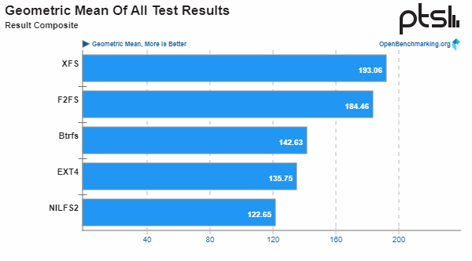

# nvme ssd disk
https://www.phoronix.com/review/linux-58-filesystems/4

https://www.youtube.com/watch?v=_fkxBD2L61c

https://www.reddit.com/r/ethstaker/comments/11g2zt2/best_linux_filesystem_for_ethereum_node_ext4_vs/

Я попробовал использовать btrfs со сжатием zstd и Erigon, и экономия дискового пространства была действительно значительной. 
Однако загрузка операций ввода-вывода и ЦП была просто смехотворной, и, похоже, было значительное усиление записи. 
По какой-то причине все еще использовал btrfs, но без сжатия или Erigon.

Честно говоря, я бы просто использовал ext4 и не думал об этом, 
если только вы не имеете в виду какие-то причудливые настройки, подобные рейдам, и не заботитесь о дополнительной нагрузке.

SATA3 connection between his disk and the system, which caps his speed at 600 Mb/s. 
Even using an NVME, PCI gen 4, he'll likely never see more then 4 Gb/s.

XFS, BTRFS and ZFS are great, but their use cases and strengths are focused on certain use cases, beyond the scope of L4N.

Seagate FireCuda 520 PCIe 4.0 NVMe SSD
https://www.phoronix.com/review/linux-58-filesystems

Btrfs, EXT4, XFS, F2FS, and NILFS2
https://www.phoronix.com/review/linux-58-filesystems/2

erigon filesystem linux

When taking the geometric mean of all the test results, 
XFS was the fastest while F2FS delivered 95% the performance of XFS for this modern flash-optimized file-system. 
Btrfs came in a distant third place finish for performance from this single NVMe SSD drive benchmark followed by EXT4 and then NILFS2.

https://www.linux.org.ru/forum/general/17071593
# F2FS
прирост скорости естественное следствие что ф2фс активно использует отложенную запись.
т.е. сообщает о финале записи файла при попадании его в рам-кеш, а не после окончания записи на носитель :)
т.е. скорость записи в ф2фс == скорости записи в рам. что сильно быстрее даже ссд.
все красиво работает пока размер копируемого меньше, чем свободное под кеш место в памяти.
и нет неожиданных обрубонов електричества с потерей данных. в принципе идеальные условия указанного есть аккурат в телепоне.

сколь помню отчеты, все остальные плюшки ф2фс для ссд на уровне остальных фс.